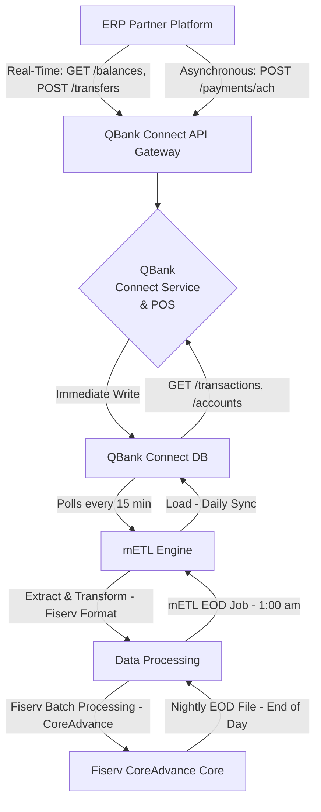

# Architecture Overview

The QBank Connect architecture was designed to solve the critical challenge of connecting a modern, low-latency API to a legacy banking system. The following sections describe how this is achieved through a hybrid approach.

## Bridging Real-Time and Batch

QBank Connect operates on a hybrid architecture, designed to provide a modern, low-latency API experience while ensuring transactional integrity with the legacy **Fiserv CoreAdvance** core banking system.

### 1. The Hybrid Data Flow (API to Core)

The system relies on the **mETL (Managed Extract, Transform, Load) Engine** to manage asynchronous batch communications with Fiserv CoreAdvance via SFTP.[^8][^9]

Here is the visualization of our data flow, which informs data freshness and latency for every endpoint:

### 2. Data Latency Explained

Due to this hybrid approach, API resources fall into two critical latency categories [^10]:

| Category | Endpoint Examples | Source | Latency Profile |
| :--- | :--- | :--- | :--- |
| **Real-Time Synchronous** | `/balances`, `/transfers`, `/payments/wire` | Direct Fiserv API Call | Sub-second latency.[^11] [^12] |
| **Batch-Latent Asynchronous** | `/accounts`, `/transactions`, `/reports/nsf`, `/reports/chargebacks` | QBank Connect DB (mETL Load) | Data is updated once per day, available after the 1:00 am cutoff.[^13] |

**Critical Note:** Resources retrieved via Batch-Latent endpoints (e.g., Transactions) reflect the state of the account **as of the end of the previous business day**. Current-day activity will not appear in these reports until the next daily synchronization at 1:00 am.

### 3. The Three Mandatory Transaction Dates

For accurate financial reconciliation and treasury reporting, the transaction resource exposes three distinct date fields. ERP integrators must understand the context of each date for compliance and cash positioning [^2]:

| Field Name | Context | Source |
| :--- | :--- | :--- |
| **`transaction_date`** | **Initiation:** The date/time the customer/ERP initiated the activity. | Core System / Client Request |
| **`value_date`** | **Interest/Funds:** The date on which funds are technically applied or debited for interest accrual calculation.[^2] | Fiserv CoreAdvance |
| **`posting_date`** | **Availability/Statement:** The date/time the transaction record was loaded by the mETL engine into the QBank Connect DB and became available via the API (1:00 am cutoff).[^14] [^15] | QBank Connect DB (mETL) |

When querying transactions, you should typically use the **`posting_date`** field for pagination and filtering to ensure you only retrieve fully synchronized and auditable records.[^14]

## References
[^2]: QBank Whitepaper, "Transaction Date Standards and Compliance," v1.1.
[^8]: Fiserv CoreAdvance SFTP Specification, "Batch Communication Protocol."
[^9]: QBank mETL Engine Design Document, "Asynchronous Data Integration."
[^10]: QBank Connect SLA, "API Latency and Data Freshness Profiles."
[^11]: QBank Performance Testing Report, "Real-Time Endpoint Benchmarks."
[^12]: Fiserv CoreAdvance API Integration Guide, "Direct Connect Latency."
[^13]: QBank mETL Operational Handbook, "Daily Sync and EOD Cutoff."
[^14]: QBank Connect Integration Guide, "Transaction Query Best Practices."
[^15]: QBank Accounting Compliance Memo, "Posting Date Audit Requirement."