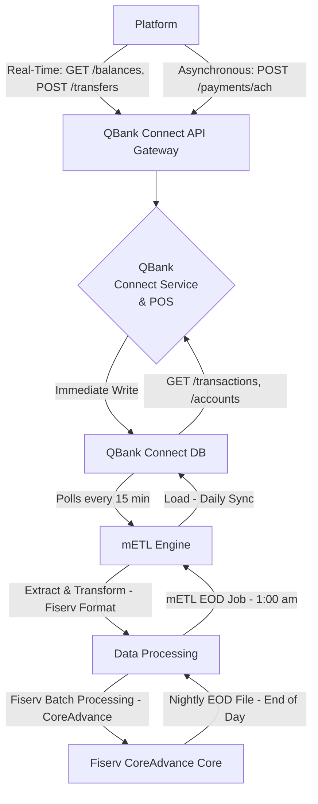

# Architecture

Qbank Connect integrates API technologies with legacy batch systems, resulting in a "hybrid" architecture.

## 1. The mETL Engine

In QBank systems, all large data exchanges are handled by the **mETL Engine**, a legacy batch ETL system. It performs nightly scheduled data syncs between the bank's internal databases and the **Fiserv CoreAdvance** core banking system. [^8] [^9] [^10] Due to this technical constraint, certain API endpoint DBs get refreshed only once a day.

## 2. Hybrid Data Flow (API to Core)

This diagram illustrates the hybrid data flow between third-party Transaction Management Platforms (“Platforms”), QBank Connect, the mETL Engine, and Fiserv.

## 3. Data Latency

The hybrid approach used by this application results in all API requests being categorized into one of two main types of latency:

| Category | Example Endpoints | Source | Description |
| --- | --- | --- | --- |
| **Real-Time Synchronous** | /balances , /transfers , /payments/wire | A direct call to the Fiserv API | Less than 1 second. [^11][^12] |
| **Batch-Latent Asynchronous** | /accounts , /transactions , /reports/nsf , /reports/chargebacks | metL import from Fiserv loader | Data is current as of the previous business day. [^13] |

## 4. The Three Required Transaction Dates

For both reconciliation and treasury reporting purposes, there are three different date fields contained in the `Transaction` resource. To meet cash position requirements and other regulatory needs, all platform developers should be aware of the background for each date field. [^2]

| Field Name | Purpose | Source |
| --- | --- | --- |
| **`transaction_date`** | Initiated: The date and time when the customer/ERP initiated the transaction. | The client's core system/request |
| **`value_date`** | Interest/Funds: The date upon which funds are actually credited/debited to compute interest accrual. [^2] | Fiserv CoreAdvance |
| **`posting_date`** | Available/Posted: The date and time the transaction record was inserted into the QBank Connect DB through the mETL engine and made available through the API. [^14][^15] | Fiserv CoreAdvance |

## 5. Documents Cited

[^2]: QBank Whitepaper, "Transaction Date Standards and Compliance," v1.1.

[^8]: Fiserv CoreAdvance SFTP Specification, "Batch Communication Protocol."

[^9]: QBank mETL Engine Design Document, "Asynchronous Data Integration."

[^10]: QBank Connect SLA, "API Latency and Data Freshness Profiles."

[^11]: QBank Performance Testing Report, "Real-Time Endpoint Benchmarks."

[^12]: Fiserv CoreAdvance API Integration Guide, "Direct Connect Latency."

[^13]: QBank mETL Operational Handbook, "Daily Sync and EOD Cutoff."

[^14]: QBank Connect Integration Guide, "Transaction Query Best Practices."

[^15]: QBank Accounting Compliance Memo, "Posting Date Audit Requirement."